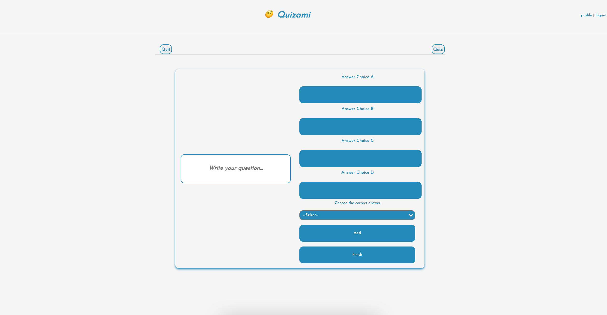

# Quizami

### Description

A website for users to create profiles and make and take quizzes.
[Visit the Quizami site](https://quizami.herokuapp.com/)

## Table of Contents

- [About This Project](#about)
- [Installation](#installation)
- [Usage](#usage)
- [Roadmap](#features)
- [Contributing](#contributing)
- [Testing](#test)
- [License](#license)
- [Questions](#questions)
- [Acknowledgements](#acknowledgement)

## About This Project

This site was designed so that anyone can sign up, create a profile, and make quizzes for their friends, as well as take quizzes others have made. It allows users to compete to see who can get the highest scores amongst their friends.

### Built With

Javascript, Handlebars, MySQL, CSS, and Nodejs

## Installation

sequelize, dotenv, express, express-handlebars, express-session, mysql2

## Usage

Once logged in, users are able to make, take, and comment on quizzes. Users can make quizzes from their profile page, take quizzes from the home page, and comment on quizzes on the comment screen before quizzes.

## Roadmap

The proposed features are added functionality for users to create a friend page, a seperate login and sign up page, rankings amongst all users based on total points and average scores, dark mode, and increased personalization of profile page.

## Contributing

Contributions are what make the open source community such an amazing place to be learn, inspire, and create. Any contributions you make are greatly appreciated.

1. Fork the Project
2. Create your Feature Branch (git checkout -b feature/AmazingFeature)
3. Commit your Changes (git commit -m 'Add some AmazingFeature')
4. Push to the Branch (git push origin feature/AmazingFeature)
5. Open a Pull Request

## Testing

To test, install dependencies, create database in MySQL using the schema provided, type "run npm seed" into your terminal to generate tables, and then type "node server.js". It should then say "Now listening". Open localhost to port 3001 and enjoy the website.

## License

This project is licensed under MIT.

## Questions

Our names are Eric Hay, Julian Almendarez, Anthony Castillo and if you have any questions about this project, you can email us at ericdanielhay@yahoo.com anthonycastillo821@gmail.com ppjalmendarez@gmail.com.
Link to project: github.universaleric github.anth8nyc github.stbxzr

## Acknowledgements

We would like to acknowledge the SMU Full Stack Development Bootcamp staff
